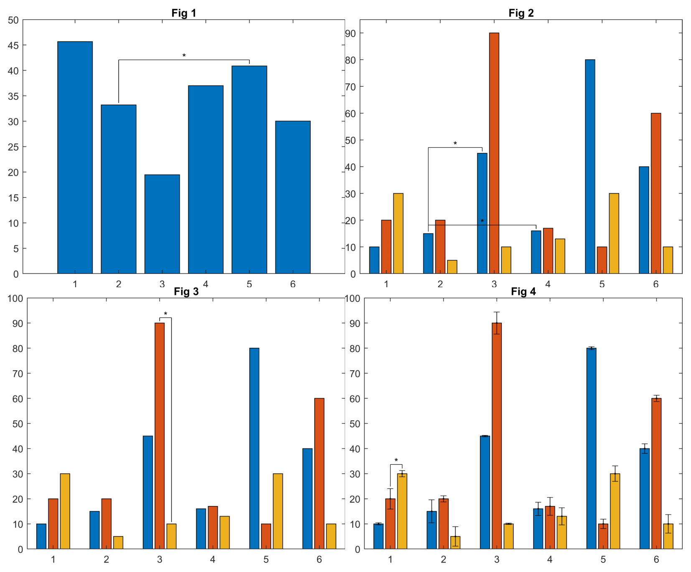

# Sigasterisk
> Implementing how significant two bars at a grouped bar plot by adding '*' with [the shown](#screenshots) style.

## Table of contents
* [General info](#general-info)
* [Screenshots](#screenshots)
* [Setup](#setup)
* [Code Examples](#code-examples)
* [Features](#features)
* [Contact](#contact)

## General info
These functions were created mainly because of:
1. Not supporting Matlab functions for asterisks to show how significant two bar is
2. Not supporting Matlab functions for adding error to grouped bar plots
3. Not supporting similar shared functions adding asterisks for different bars in different groups 

## Screenshots


## Setup
Just add the package path.

## Code Examples
Figure 1
```
figure;
Data = transpose([45 33 18 37 42 30]);
ylim([0 50]);
bar(Data);
sigasterisk(1,1,2,5,"*",Data);
title("Fig 1");
```
Figure 2
```
figure;
Data = [10 20 30;15 20 5;45 90 10;16 17 13;80 10 30;40 60 10];
bar(Data);
sigasterisk(1,1,2,3,"*",Data);
sigasterisk(1,1,2,4,"*",Data);
title("Fig 2");
ylim([0 95]);
```
Figure 3
```
figure;
bar(Data);
sigasterisk(2,3,3,3,"*",Data);
title("Fig 3");
```
Figure 4
```
figure;
Errors = rand(6,3)*5;
bar(Data);
add_errorbar(Errors, Data);
sigasterisk(2,3,1,1,"*",Data,Errors);
title("Fig 4");
```

## Features
* You can change all dimensions which are used to plot by optional arguments

To-do list:
* Different height used if the function for a column is used twice.

## Contact
Created by [@arsalanfiroozi](https://ee.sharif.ir/~firoozi.arsalan) - feel free to contact me!
